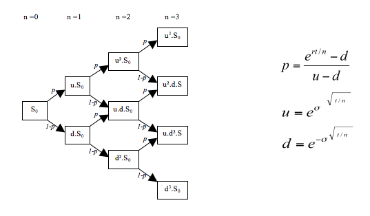

This is a write-up about my Python program to price European and American Options using Binomial Option Pricing model.

In this post, I will be discussing about using the Binomial Option Pricing model to price European and American stock options. ~~This is essentially a write-up about my python project on GitHub: [Blot_Quant](https://github.com/Aditya-dom/Blot_Quant/tree/main/Mathematics/Binomial_Asset_Pricing). Do check it out if you want to use the code for your own proprietary models.~~ Coming Soon!! 

Options are a contract where the buyer of a call option (or put option) has the right but not the obligation to buy (or sell) the underlying stock at a particular strike price (K) at a given expiry date. Modelling the value of options is generally hard due to its dependence on the price of the underlying security (and we know stocks are notoriously hard to predict). Hence, we resort to implementing certain assumptions regarding the relationship between the option value and stock price, and the general market itself. The crux of the assumption is called the No-Arbitrage Condition (NAC). Arbitrage is at its core a market inefficiency, which results in investors having infinite earning potential without incurring the inherent risk in stocks. Clearly, this is not the case in reality and hence we assume that there is no arbitrage in our model. Furthermore, assuming NAC, we can deduce that **_the value of portfolio of stocks and bonds that pays off the exactly like the option must have the same value at time zero_** This is the crucial idea behind the Binomial Option Pricing Model.

Now we can introduce the Binomial part of the model. Given the initial stock price, we allow it to either go up or down by a factor u and d respectively at every branch point. The number of time intervals (or branches) depends on how complex you want the model to be. The following diagram sums up how the binomial price tree is constructed.



## Formula

The binomial tree model involves several key parameters:

- $\( S_0 \)$: Current price of the underlying asset
- $\( u \)$: Up factor (rate of upward movement)
- $\( d \)$: Down factor (rate of downward movement)
- $\( p \)$: Probability of an upward movement
- $\( (1 - p) \)$: Probability of a downward movement
- $\( r \)$: Risk-free interest rate
- $\( \Delta t \)$: Time step

### Up and Down Factors

$$\[ u = e^{\sigma \sqrt{\Delta t}} \]$$

$$\[ d = e^{-\sigma \sqrt{\Delta t}} \]$$

### Risk-Neutral Probability
$$\[ p = \frac{e^{r \Delta t} - d}{u - d} \]$$

## Pricing an Option

To price a European call option using a binomial tree, follow these steps:

1. **Construct the price tree:** Calculate the possible prices of the underlying asset at each node of the tree.
2. **Calculate the option value at the terminal nodes:** At expiration, the value of a call option is $\( \max(S_T - K, 0) \)$, where $\( S_T \)$ is the stock price at expiration and $\( K \)$ is the strike price.
3. **Back-propagate the option values:** Using the risk-neutral probabilities, calculate the option value at each node by discounting the expected value of the option's payoff at the next time step.

### Backward Induction
$$\[ C(i, j) = e^{-r \Delta t} \left[ p C(i + 1, j + 1) + (1 - p) C(i + 1, j) \right] \]$$

where $\( C(i, j) \)$ is the option value at node $\( (i, j) \)$.

Now we introduce the new concept of risk neutral probability. Risk neural probability is the probability of an up or down price movement, p and q respectively, in the risk neutral probability measure. The risk neutral probability allows us to define a discounted stock price, which accounts for the time value of money. Turns out the discounted stock price is a Markov Process under the risk neutral probability measure (for more details on probability measures and Markov Processes, please refer to Stochastic Calculus for Finance I by Steven Shreve).

So if we are given the return of the option at time of exercise, we can calculate recursively the value of the portfolio in terms of stocks and bonds that result in the same return. According to NAC, this should give us the value of our bond at current time.

The difficulty in this model arises in modelling the volatility to input into the up and down factors. This is where I have attempted a few methods: simple exponentially weighted moving average, GARCH model (which I will explain in more depth in another post).

### Implementing in Python

Now we can get to the implementation of the model in Python. I had a few key principles in mind: customisability and improvement of volatility modelling. Customisability is necessary because of the nature of security derivatives and the existence of exotic options. Models such as Black-Scholes are more rigid in terms of customisability, so I want to make sure my Binomial Model is not so. Predicting volatility is key to being able to build the stock price tree, since the up and down factors depend heavily on volatility. Hence, I wanted to try multiple methods and see which of it is the best.

**Main files**
The file that is central to modelling the stock options is `stock_option.py` because it contains all the important common characteristics of a stock option and allows the user to customise what type of option they want to model using the `prm` argument. Once we have the common characteristics defined, we can focus on a specific type of option in the separate files. For example, the `eu_option.py` file is used to model the European option and is where the entire of the mathematical framework lies. Most of this is established material. The main advancement I can implement is in the `stock_volatility.py`file, where I code the various volatility models. Now we will look at how the GARCH model was used.

**Volatility Prediction**
Since predicting the volatility of the stock is paramount to pricing the option accurately, I invested some time in learning the GARCH model, which is commonly used to model volatility. **_To use the GARCH model however, the time series had to stationary_** (will be explained in GARCH post), which in essence means that the series has no trend. To make the stock price stationary, I looked at the return of the natural logarithm of the stock price. Once the series is stationary, we need to decide on the parameters for the GARCH model. This can be done by looking at the Autocorrelation plot of the series. Having decided on the parameters, I implemented the GARCH model using the library `arch` as such:

```
import numpy as np
import pandas as pd
import pandas_datareader.data as pdr
import yfinance as yf
import arch
import matplotlib.pyplot as plt
from statsmodels.graphics.tsaplots import plot_acf
yf.pdr_override()
class stock_vol:
def __init__(self, tk, start, end):
      self.tk = tk
      self.start = start
      self.end = end
      all_data = pdr.get_data_yahoo(self.tk, start=self.start, end=self.end)
      self.stock_data = pd.DataFrame(all_data['Adj Close'], columns=["Adj Close"])
      self.stock_data["log"] = np.log(self.stock_data)-np.log(self.stock_data.shift(1))
def garch_sigma(self):
      model = arch.arch_model(self.stock_data["log"].dropna(), mean='Zero', vol='GARCH', p=1, q=1)
      model_fit = model.fit()
      forecast = model_fit.forecast(horizon=1)
      var = forecast.variance.iloc[-1]
      sigma = float(np.sqrt(var))
      return sigma
```

The reason why I used a class to model volatility and then defined the GARCH model as a function is so that I can implement multiple models to compare when pricing the option. Apart from the GARCH model, I also predicted volatility using a simple exponentially weighted standard deviation:

```
def mean_sigma(self):
   st = self.stock_data["log"].dropna().ewm(span=252).std()
   sigma = st.iloc[-1]
   return sigma
```

> Now comes my favorite part.(mathematics, which I have learned for JEE and am implementing here. Life is uncretain. I Mean, LOOK AT YOU. hehe!😁)

### Building Price Tree
When building the price tree, I was faced with choosing what method to use: binomial tree and __upper triangular matrices__ were both sound choices. I ended up choosing upper triangular matrices due to the highly optimised `numpy` library. I set the initial stock price to be [1, 1] of the matrix and split along the diagonal every iteration to build the stock price tree. The portfolio value tree was the same as the stock tree, except that it was build recursively, starting from the nth column. I implemented as such in my program:

```
class euro_option(stockoption):
   '''
   calculate required preliminary parameters:
   u = factor change of upstate
   d = factor change of downstate
   qu = risk free upstate probability
   qd = risk free downstate probability
   M = number of nodes
   '''
   def __int_prms__(self):
      self.M = self.N + 1 
      self.u = math.exp(self.sigma*math.sqrt(self.dt))
      self.d = 1./self.u
      self.qu = (math.exp((self.r-self.div)*self.dt)-self.d)/(self.u-self.d)
      self.qd = 1-self.qu
      
   def stocktree(self):
      stocktree = np.zeros([self.M, self.M])
      for i in range(self.M):
         for j in range(self.M):
            stocktree[j, i] = self.S0*(self.u**(i-j))*(self.d**j)
      return stocktree
def option_price(self, stocktree):
      option = np.zeros([self.M, self.M])
      if self.is_call:
         option[:, self.M-1] = np.maximum(np.zeros(self.M), (stocktree[:, self.N] - self.K))
      else:
         option[:, self.M-1] = np.maximum(np.zeros(self.M), (self.K - stocktree[:, self.N]))
      return option
def optpricetree(self, option):
      for i in np.arange(self.M-2, -1, -1):
         for j in range(0, i+1):
            option[j, i] = math.exp(-self.r*self.dt) * (self.qu*option[j, i+1]+self.qd*option[j+1, i+1])
      return option
def begin_tree(self):
      stocktree = self.stocktree()
      payoff = self.option_price(stocktree)
      return self.optpricetree(payoff)
def price(self):
      self.__int_prms__()
      self.stocktree()
      payoff = self.begin_tree()
      return payoff[0, 0]
```

#### Future Plans
> The model now is relatively accurate at predicting option prices and is highly customisable. However, I do intend to improve the prediction of volatility by constantly updating the model based on latest research. Furthermore, I've also build a [Black Scholes mode](https://github.com/Aditya-dom/GBS_Option_pricing) check it out and compare it with my Binomial Option Model.

#### Conclusion
> I hope you have found this read useful and maybe I have sparked your interest in finance.