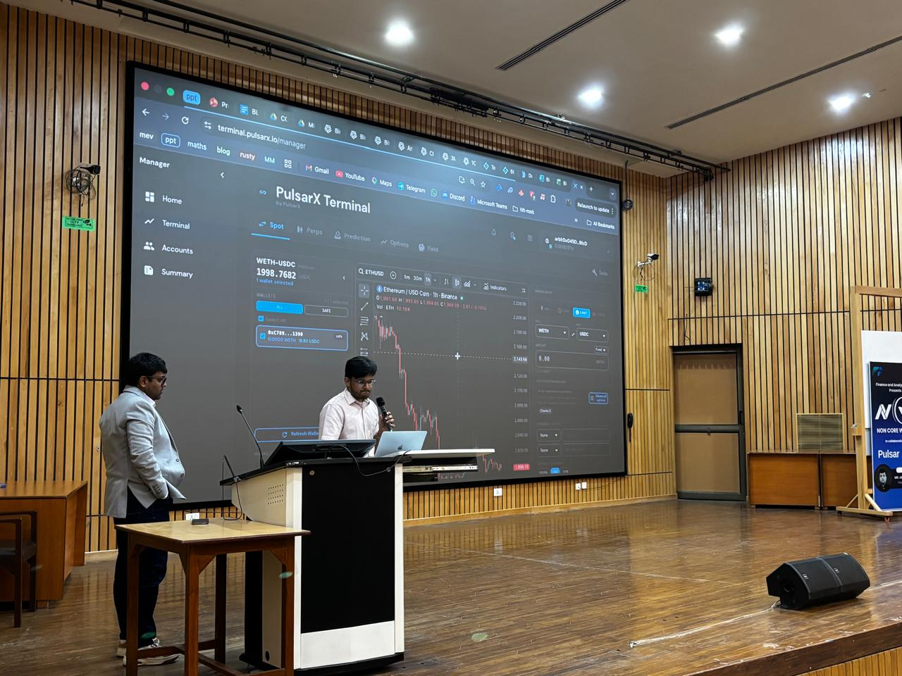

> The edge isn't intelligence, it's refusal to dilute. Years of depth on one problem compounds into something breadth never produces. Most people never find out because they keep switching. Excellence is a choice.

## The Switch

2026 started with a job change. I joined a proprietary crypto hedge fund. the kind of place where your P&L is the only performance review that matters. You build strategies, you trade, you ship execution infrastructure and the market tells you if you're right. Every day.

Side by side, we're building PulsarX — a product for fund managers and partners to do onchain capital management in a fully non-custodial way. The thesis is simple: you should be able to delegate specific trading permissions to a fund manager without ever giving up custody of your funds. No omnibus accounts. Your capital sits in your Safe(multsig) wallet, the manager operates within policy bound delegations and every action is verifiable onchain. The way institutional DeFi should have been built from the start.

This is the work I care about most. Building strategies and trading systems for better execution. Building a terminal that is properly onchain without compromising custody. The infrastructure layer between TradFi collateral management and DeFi execution.

## Presenting and Sharing Experience at IIT Kanpur

Recently had the opportunity to present at the Indian Institute of Technology Kanpur, where I spoke about my experience in trading, digital assets, web3, and what I'm currently building i.e PulsarX. Big Thanks to [Abhishek Singh](https://www.linkedin.com/in/abhishek-kumar-singh-96b827184/), Founder of PulsarX, for making it happen. The overall experience was great always good to talk to people who are genuinely curious about how markets work at the infrastructure low level.

## Two International Hackathons. Two Wins.

### Perennia — The Everlasting Options Protocol

I participated in the [Pacifica Hackathon](https://pacifica.gitbook.io/docs/trading-on-pacifica/overview) — Pacifica being a DEX that supports perpetual and spot trading on Solana. I built [Perennia](https://perennia.xyz/), an everlasting options protocol. Trade crypto options with no expiry, built on top of Pacifica.

What makes it "everlasting"? Instead of expiring, the instrument is priced as a weighted sum of short dated BSM options across an infinite horizon approximation:

$$
V = \sum_{n=1}^{\infty} \left(\frac{1}{2}\right)^{n+1} \cdot V_{BS}(T = n \cdot f)
$$

That's the core intellectual idea. No expiry management, no roll costs, continuous exposure. The funding mechanism replaces discrete settlement with a perpetual payment stream, analogous to how perpetual swaps replaced futures rolls. For those who want the full derivation, read [Paradigm's Everlasting Options Model](https://www.paradigm.xyz/2021/05/everlasting-options) by [Dave White](https://x.com/_Dave__White_) and [Sam Bankman-Fried](https://x.com/SBF_FTX). I'll cover the full architecture: pricing engine, funding formula, delta and vega hedging via Pacifica perps, the protocol acting as market maker (We are working on the LP Vault and RFQ model) in a separate post.

### Dark Bridge — Private Cross-Chain Transfers

Then the [Solana Privacy Hackathon](https://x.com/inconetwork/status/2023456144921157665?s=20), where I built [Dark Bridge](https://darkk-bridge.vercel.app/): a decentralized but private bridge to move any digital currency between Solana and Base (or vice versa) using Inco's TEE privacy stack. The idea: crosschain transfers shouldn't be a public announcement of your portfolio movements.

## On VCs, Attention, and What Actually Matters

Honestly, I don't fully understand what VCs see in some of the things they fund. Maybe strong connections, maybe positioning, maybe just deploying capital where retail attention can be captured. A lot of times it feels like they don't overthink these bets. we saw this during the NFT phase of 2021, where Ronaldo had NFTs buying for millions and most of that doesn't make much sense in hindsight.

Often it's about capturing retail attention, and eventually it turns into a pump and dump cycle. But the market is changing. More institutions and serious players are moving onchain. The protocols that survive are the ones actually pushing infrastructure forward.

Which brings me to Hyperliquid.

## Jeff Yan and the Case for Obsession

If you don't know about Jeffrey Yan, go look him up. Founder of [Hyperliquid](https://hyperfoundation.org/). Harvard math and CS, started at Hudson River Trading doing HFT, left to build Chameleon Trading: a crypto market making firm he ran almost single handedly from Puerto Rico, starting with $10,000 and compounding at several thousand percent annually for two and a half years.

Then [FTX collapsed](https://en.wikipedia.org/wiki/Bankruptcy_of_FTX) and instead of walking away, he saw the opening. He built Hyperliquid: a custom L1 blockchain designed from scratch for trading, processing $10B+ in daily volume, with a team of 11 people. Zero venture capital. Zero influencer campaigns. The platform grew purely on product quality. When they launched the HYPE token, 31% went directly to users. No VC allocations. The remaining supply reserved for community and ecosystem growth.

The result? One of the most profitable companies per employee on Earth — 11 people generating over $900 million in annual profit.

Jeff posted something on Twitter that stuck with me:

> _Hard work is more important than smart work. It's a myth that we only have a few hours of good creative work per day. Train yourself to grind long hours first. You will surprise yourself. The work naturally becomes higher quality, less distracted._

— [@chameleon_jeff](https://twitter.com/chameleon_jeff/status/1632001035991670784)

This isn't motivational fluff. This is someone who bootstrapped a billion-dollar protocol by being consumed by the problem for years. No distractions, no diversification of effort, no hedging his time across ten different things.

BTW, I want to tell you that the [Perennia](https://perennia.xyz) I built the everlasting options model is co-authored by FTX founder i.e. [Sam Bankman-Fried](https://x.com/SBF_FTX). Be it FTX collapsed, but check what he did in the crypto space while he was active he was one of the smartest people.

## The Intern Hunting Lesson, Revisited

A year ago I wrote about [intern hunting](/posts/intern-hunting/) the stochasticity of outcomes, the importance of sticking to your list, not applying to everything out of desperation. The core thesis was: proceed by elimination rather than addition. Know what you want, say no to everything else, and go deep.

That philosophy hasn't changed. If anything, 2026 has only reinforced it.

If you work daily on something genuinely daily, not "when I feel like it" daily..it will take time but it will happen. The compounding isn't linear. For months you feel like you're going nowhere. Then something clicks and the last two years of stacked context suddenly becomes leverage. The strategies I'm building now are only possible because of the infrastructure thinking from ShadeRed which is my MEV project, the microstructure research from the Dopespreader, the onchain architecture from PulsarX, the pricing work from Perennia. None of it was wasted. All of it compounds.

The people who are dramatically ahead of their age cohort aren't smarter. They just picked one thing and refused to stop. They traded breadth for depth, and depth for compounding returns on their own skill.

Excellence is a choice. And it's a choice you make every single day, in what you say no to as much as what you say yes to.

## What's Next

More building. More trading. More shipping. The blog will get its Perennia deep dive soon and how it works under the hood: full architecture, pricing engine, funding mechanics, the works. The onchain capital management stack is getting closer to something real. And the market keeps teaching lessons, which is the only teacher that never grades on a curve.

> Stay loaded.