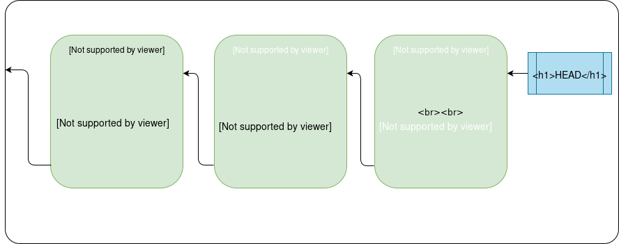
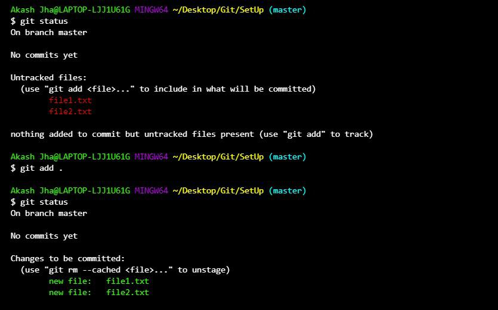
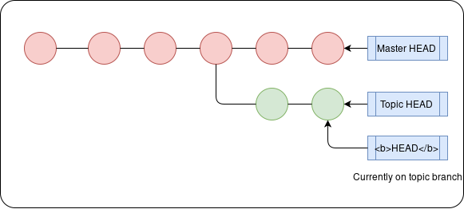
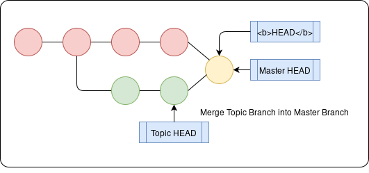
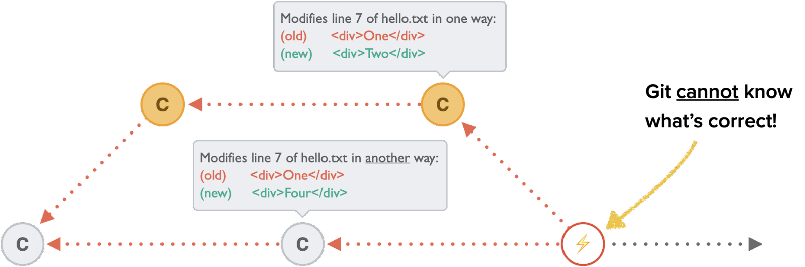
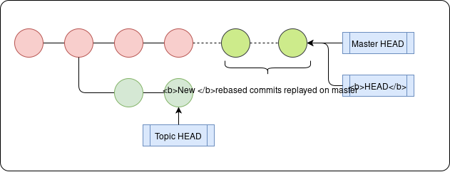
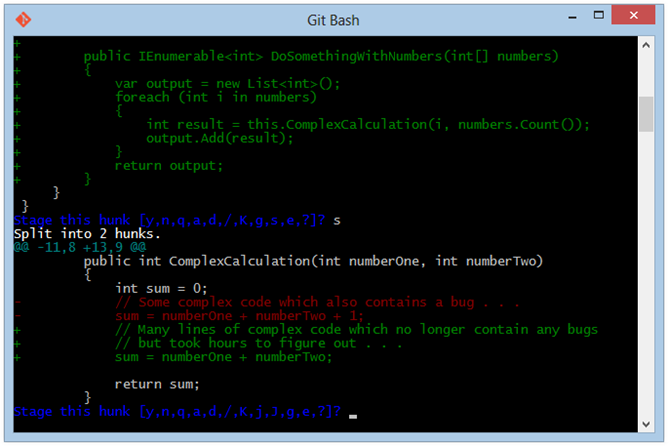
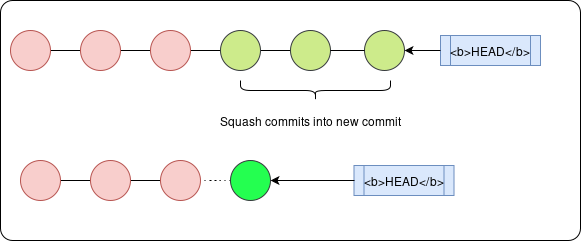
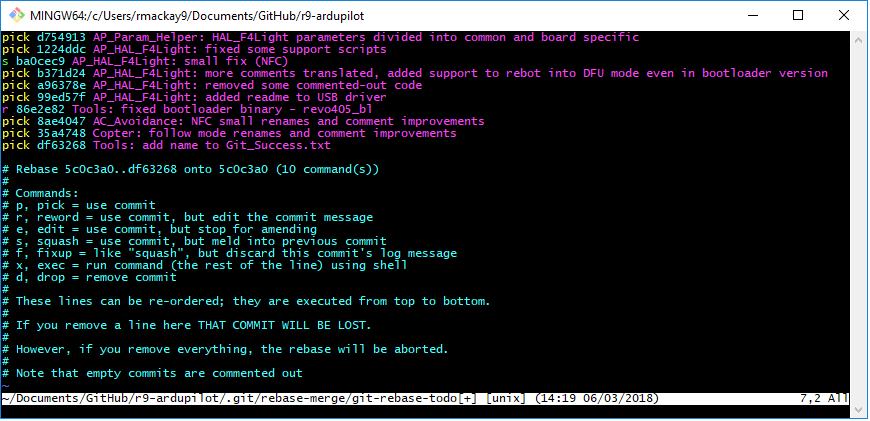
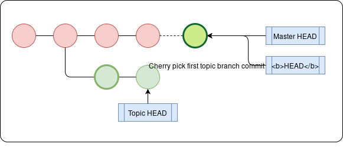

>>>> I wish my hippocampus was compatible with git version control

# What is Git and why should I care?
Git is a distributed version-control system - i.e. it records the changes made to files in a repository of code as a series of snapshots called _commits_, stored on many servers. Think of this like your standard cloud backup on steroids - not only are you able to restore your code in event of a crash, but you can also roll back your code to any of the snapshots if your code breaks. It is also easy for you to collaborate with others - again just like how you can work on the same Google Docs file with multiple people, multiple developers can simultaneously edit the same repository and record their individual changes.

Thanks to these advantages, Git is a must-know for anyone looking to enter the world of software development. This post will provide an overview of the most useful commands in Git and when to use them, and also serves as a reference for when you need to brush up on Git.

The Git Workflow
There are a lot of Git commands, so it’s useful to group them by topic / use-case. We’ll first consider Git on a single machine, since most of Git’s operations are local and we can then build up to multi-user Git usage.

Git can either be run using the command line, or using a GUI such as GitHub Desktop. Although the command line may be more intimidating for new developers, it also is far more powerful and you will need to learn it since most GUIs offer limited commands.

Git commands typically take the form of `git <command>` `<args>` where `<args> `might be a file path. Commands may also have options specified denoted by a `--<option>` or a `-<single-letter-option>` - think of these as adding extra details as to what the command should do. In this guide, I will present the general syntax and you should replace anything in `<>` with your corresponding value.

If you are uncertain about the usage of a command, a really useful command is: `git help <command>` which brings up the manual, or for a refresher `git <command> -h `or `git <command> --help` (`--help` and `-h` are equivalent).

# Setting up Git

## Installing Git
- Windows: Head to https://git-scm.com/download/win

- MacOS: Git comes as part of XCode Command Line Tools, so install that. To check if you’ve installed Git already open a Terminal window and type `git --version` to check which version you have.

:::Note
If you don't know about Xcode just get familiar with Brew package manager of macOS.
cmd: `brew install git` 
:::

- Linux: Run `sudo apt install git-all` (Debian-based) in the terminal or `sudo dnf install git-all` (RPM-based).


## Set up Configuration File
The first thing to do having installed Git is to set up your user name and email address, since these are used to identify you and stored in all snapshots you make. This is stored in a configuration file where you store all your preferences.

You can either edit this `.gitconfig` file directly using a text editor or `git config --global --edit` or instead alter specific fields with g`it config --global <field> <value>` - we’re interested in the fields `user.name` and `user.email`.

We can also configure the text editor we use for commits using the field `core.editor` - initially this is set to the system default editor (e.g vi for Linux/Mac). `commit.template <template_file>` lets you specify a template that comes up whenever you commit.

There are many other fields, however one particular field I find especially useful is `alias` which maps commands to abbreviations: `alias.<ab> <command>`. e.g. `git config --global alias.st "status -s"` maps `git status -s` to `git st`.

`git config --list` lists all the fields and values from the config file.

## Create a Git repository
To initialise a .git repository you can use `git init` or, if you want a copy of an existing repository, you can do `git clone <repo_url>`.

> After git config make your first Repository on github with `git init`


## Git Commit History



Git stores data as a series of lightweight “snapshots” known as commits - these store the state of the filesystem at that time as well as a pointer to the previous commit(s). Each commit has a unique _checksum_ - the ID Git uses to refer to it. To keep track of the history, Git has a HEAD pointer that points to the first commit (we follow the pointer chain back to see previous commits).

So we can refer to a commit either by its checksum, or its relation to HEAD, e.g.`HEAD~4` refers to the commit 4 commits before the HEAD commit.


.[](./file-system.png)

Git keeps track of files in 3 main sections:

Working Directory (this is your computer’s filesystem)
Staging Area (this stores the contents of your next commit)
HEAD (the most recent commit in the .git repository)
All of the main file commands boil down to understanding how Git maintains these three sections. A common misconception is that the staging area only stores changes - a better way to think of these is as 3 separate file systems, each with their own copies of the files.

## View changes in the Git File Systems
`git status` displays any files that differ between the 3 sections. Files have 4 states:

- _Untracked_ - in Working Dir but no version stored in HEAD or Staging Area (Git doesn’t know about file)
- _Modified_ - newer version in Working Dir compared to Staging Area and HEAD. (changes not in next commit)
- _Staged_ - newer version in Staging Area and Working Dir compared to HEAD. (ready to be committed)
- _Unmodified_ - same version in all 3 sections (i.e. most recent commit has latest version)

:::Note 
A file can be both modified and staged, if the version in the working directory is newer than that in the staging area, which in turn is newer than the one in the HEAD commit.
:::

We can use the `-s` option for `git status` to get a cleaner (one line per file) output. This displays ?? if a file is not tracked, red if modified and green if staged.

To view the actual changes and not just the files that have changed, you can use:

- `git diff `- see the unstaged changes i.e. compare working directory with staging area.
- `git diff --staged` - see the staged changes i.e. compare staging area with HEAD.
Adding the `<file/dir>` argument restricts the diff to that those files. e.g. `git diff src/`

## Update the Git File Systems
`git add <file/directory>` updates the staging area with the version of the file/directory in the working directory.

`git commit` updates HEAD with a new commit that snapshots the files in the staging area.

`git reset <commit>` has three potential steps:

1. Point HEAD to `<commit>` (e.g. if rolling back a commit,staging area and working dir will now have newer version of files than HEAD). Also points branch’s HEAD to that commit. (see Branching section)
2. Update Staging Area with contents of `<commit>`. (this has the effect of unstaging file changes - only Working dir. has newest version)
3. Update Working Dir with contents of Staging Area (has effect of overwriting and destroying changes to data - dangerous - take care)
By default, `git reset` only runs Step 1 + 2 however, the options `--soft` (only run Step 1) and `--hard` (run Step 1, 2, 3) modify its behaviour.

If we pass a file path, `git reset <commit> <file/dir>` it limits effect of `reset` to files in that file path e.g. `git reset --soft HEAD~1 src/`.

`git checkout HEAD <file>` also has the same effect as `git reset --hard HEAD <file>` - it overwrites the version of the file in the staging area and working directory with the version at HEAD (effectively undoing your changes since the last commit).

`git checkout <file>` on the other hand (note no `HEAD`) overwrites the version of the file in the working directory with the version in the staging area (effectively undoing your changes since the last staged version).

Finally, `git rm <file>` untracks the file and deletes it from working directory, the option `--cached` will untrack a file but not delete it from the working directory.



## Ignoring files
Often we don’t want Git to track all of our files in our repository. This might include:

- sensitive files (e.g. passwords.txt)
- huge binary files
- build files that get generated every time you recompile your source code.
- OS/IDE specific files, e.g. `.DS_Store `for MacOS or .`iml` for IntelliJ IDE - you want your repo to be as system agnostic as possible.

We can specify glob patterns (think simplified regular expressions) to match files that we want to ignore in our `.gitignore` file.

- `/___ `avoids recursivity - only matches it to current directory
- `__/ `matches all files in that directory
- `*___ `matches all files with that ending
- `!`negates a pattern - i.e. don’t match this
- `[__]` matches a character to any of the characters in the square brackets.
- `?` matches any character
- `/**/` matches nested directories e.g. `a/**/d` matches `a/d` `a/b/d` `a/b/c/d` etc.

[Examples of `.gitignore `files](https://github.com/github/gitignore)

You can even use glob patterns when using `<file/dir>` in the other Git commands e.g. `git add src/*.css` would add all `.css` files in the `src` folder.

## Commits
Since commits are the backbone of your version history, it is worth going into them in more depth.

`git commit` opens up your text editor for you to write a commit message in. The `commit` command also can takea few common arguments

- `-m` Write the message inline e.g. `git commit -m "Fix a bug`"
- `-a` This stages all modified (tracked) files and includes them in the commit (avoiding a `git add` before you commit)
- `--amend` replaces the last commit with a new amended commit- useful if you mistyped the most recent commit, or subsequently staged files that you wanted to add to the last commit - just run `git commit --amend`.

Good practices to adhere to:

- Commit often: you can’t roll back a change unless the original state was committed.
- One commit for one change: don’t bundle up all your unrelated changes in one commit, commit them separately as it makes it easier to roll back changes.
- Message format: The title should be in the imperative and less than 50 characters long, if in doubt your message should complete the phrase `this commit will _____`. The message should explain WHY the commit is made - the commit itself shows WHAT changed. [This post](https://cbea.ms/git-commit/) has all the details of a good commit message.
- (Optional) Don’t commit extremely minor changes: in a large repository, lots of tiny commits can clog up the history - a good tip is to make minor commits when developing and then _squash_ (see section on squashing) these into one major commit when contributing to the large repo.

## Viewing changes in your Git History
To see the history of previous commits in reverse chronological order, we can use the command `git log`. This has a number of options we can pass:

- `-p` shows differences introduced in each commit
- `--stat` shows abbreviated stats for commits e.g. files changed and lines added/deleted in each file.
- `-n` shows the last n commits (e.g. `-4` for last 4 commits)
- `--since=___` and `--until=___` allows you to filter from a certain point e.g. `--since="2019-01-01"`
- `--pretty` allows you to specify the format of the log (e.g `--pretty=oneline`), you can also set `--pretty=format <custom format>` for more customisation. e.g. `--pretty=format:"%h %s"`
- `--grep` and `-S` filter commits with commit messages/code changes respectively containing that string e.g. `git log -S` `function_name` to see add/removal of reference to a function.
- `--no-merges` filters out merge commits
- `branch1..branch2` - this allows you to see which commits are in branch2 that aren’t in branch1 (useful if you want to merge branches) e.g. `git log master..test` lets you see any commits in your test branch that aren’t in the master branch. (See Branching section for description of branches).
- `--left-right branch1...branch2` - shows commits that are in either branch1 or branch2 but not in both - with < if in branch1, > if branch2. (NB triple dot not double dot)
- `-L` this takes in either argument `start,end:filename` or `:funcname:filename` and shows the history of changes of a given set of lines or a function in a file.

Finally, `git log <file/dir>` will only show the commits affecting those file(s).

All in all, `git log` is a very powerful tool, and there are even more potential options, so whilst you shouldn’t try to learn them all, know that you have these options at your disposal when tracking changes to the repo over time.

Another useful tool is `git blame <file>` which (as the name suggests) attributes ownership/blame to each line of the file, showing the checksum of the most recent commit that modified that line and the corresponding author. `-L<start>,<end>` lets you restrict this search to the specified lines in the file e.g. `-L134,150` restricts this to lines 134 to 150. One particular use case is if you wanted to isolate which commit caused a particular bug (so you can roll it back).

Finally, there is one other useful tool called `git grep`, which searches all files in commit history (not just working directory like `grep`) for the regex. The `-n` option displays the corresponding line number in file for each match, and `--count` shows the number of matches in each file.

NB: don’t confuse `git grep` with `git log --grep`, the former searches the files across commits, whilst the latter looks at log messages!

## Remote Servers
So far we have discussed Git used only on your local machine, however we can extend Git to store commit history on remote repositories, which we can track and update (think of these analogous to remote cloud backups of our commit history).

The `git remote -v` command lists the remote repositories we are tracking and their respective handles (the names we use to refer to them).

When we run `git clone <repo_url>`, not only do we download a copy of the repository on our machine but we also implicitly track the remote server at `<repo_url>`, which is given the handle `origin`.

The most common commands:

- `git remote add <handle> <url>` - add a remote server and handle
- `git remote remove <handle>` - remove the remote server corresponding to the handle
- `git remote rename <old_hdl> <new_hdl>` - rename handle used
- `git remote set-url <handle> <url>` - change the remote server the handle points to
- `git remote show <handle>` - get info about a remote

These commands deal with remote branches (see branching section)

- `git fetch <handle> <branch>` get data from handle’s branch but don’t merge changes
- `git pull <handle> <branch>` merge data from handle’s branch
- `git push <handle> <branch>` send changes to the remote branch. If the local branch is already tracking a remote branch, then we can just run `git push` or `git pull`.
Git push pull diagram


Multiple people can thus pull changes from the server, make changes to their local copies, and then push the changes to the remote server, allowing you to collaborate on a single repository.

## Branching
This is all well and good if each of the individual developers is working at different times. The diagrams above showed push/pull where only the origin changed, or the local copy changed, not when multiple people are working.

This leads us to a key feature of Git - branching - the ability to work on diverging lines of development. This means that rather than having a single list of commits in order, our history will diverge at points (looking more like a tree). Branches in Git each consist of a _ightweight HEAD pointer_ to the most recent commit in that branch. This makes it incredibly cheap to create multiple branches in Git. TIP: name the branch based on the _topic_ you are working on. The default branch is called master.


We now have an overall HEAD pointer (bolded to differentiate it) and a HEAD pointer associated with each branch. Switching branches thus only involves moving HEAD to the respective branch’s HEAD pointer.



### Standard commands:

- `git branch <branch_name>` creates a new branch, with its HEAD pointer pointing to HEAD. If no `<branch name>` is supplied it lists the local branches.
- `git checkout <branch_name>` switches to a branch (adding the -b option initialises a new branch before switching to it).
- `git branch -d <branch_name>` deletes the branch
Just like how our local copy of the repo can have multiple branches, so too can the remote repo, so when you track a remote repo, your branch is actually tracking a remote branch (`git clone` links your master branch to _origin/master_, the master branch of the remote repo).

### Linking to a remote branch:

- `git branch -u <remote_handle>/<remote_branch>` - link current branch to that remote branch
- `git checkout --track <remote_handle>/<remote_branch>` -equivalent to `git branch -u`
- `git checkout -b <branch_name> remote_handle/remote_branch` creates a new local branch and tracks a remote branch.
- `git branch --vv` is a good tool to see all local branches and which remote branches they are tracking
- `git checkout remote_branch_name` will create a local branch of the same name and track the remote.

In general, `git checkout` deals with changing where the branch’s HEAD points to, much like how `git reset` moves the overall HEAD.

## Stashing and Cleaning
There is one subtlety however - when switching branches, Git requires that your work state is clean, i.e. any changes made to tracked files are committed. However, sometimes you have unfinished changes that can’t be committed - the solution is to stash them using `git stash` - this is a stack of unfinished changes. To get the changes back, run `git stash apply`.

You might instead want to wipe out any changes you made - you can do this using `git clean` - the `-d` option removes untracked files as well. (Tip add the `-n` option as this shows what would be done if you ran `git clean` without actually doing it)

## Combining Branches
So now that we have discussed branches and how to switch between them, it is worth discussing how we combine these branches once we’ve finished the diverging development. By convention we will refer to the branch we want to combine into the _base branch_ and the branch to be combined the _topic branch_. The two principal ways are merging and rebasing.

### Merging
Merging involves creating a new merge commit - this is based off a common ancestor commit of the two branches, and it points to both HEADs of branches as its previous commits. We do this by switching to the base branch, and then run git merge <topic branch>



If both branches alter the same part of a file then we have a merge conflict - this is where Git doesn’t know which version to keep, so you have to resolve it yourself. To see which files have a conflicting update you can run `git status`.

Once you open the file(s) with a merge conflict you will see conflict-resolution markers as follows:

```bash
<<<<<<< HEAD:index.html
 Everything above the ==== is the version in master.
 =======
 Everything below the ==== is the version in the test branch.
 >>>>>>> test:index.html
```

Replace everything in that block with the version you want to keep and stage the file to resolve that conflict. Once you’ve resolved all merge conflicts you can then `git commit` to finalise the merge.




### Rebasing
Rather than combine the two branches with a merge commit, rebasing instead _replays_ the commits of the topic branch as a series of new commits on top of the base branch, resulting in a cleaner serial history.




To rebase we run `git rebase <base branch> <topic branch>` which replays the topic branch’s changes on top of the base branch, with the topic branch’s HEAD pointer pointing to the most recently replayed commit. We then _fast-forward_ the base branch’s HEAD by first switching to that branch using `git checkout <base branch>` and then running `git merge <topic branch>`.

### Rebasing vs Merging
Merging commits leads to a log detailing the history “as-is” and can end up looking quite messy. Rebasing on the other hand, allows you to rewrite the story in a nice serial manner.

So why merge when you can rebase all the time? Unfortunately rebasing isn’t a panacea for messy logs, since the rebased commits are actually different to the original commits, despite appearing to have the same author, message and diffs.

Consider this scenario:

- You write some commits in your branch and merge them into the master branch.
- Someone else decides to work based off your commits
- You decide to rebase your commits and push to the server
- When they decide to merge their work in based on your original commits, you end up with two parallel branches of history with the same author and message and diffs but different commits - very confusing!

A good rule of thumb is therefore:

_Only rebase changes to your local private branch_ - do not rebase commits others are dependent on.

### Rolling back Commits - Revert vs Reset
A similar debate comes across when you want to roll back a commit. `git revert <commit>` creates a new commit undoing the changes but preserving the history, whereas `git reset <commit>` changes position of HEAD giving a cleaner history (it’s as if those commits never happened). Note crucially that this also means you can no longer roll-back to those changes, e.g. if you decided that actually you wanted to keep those changes. Cleaner does not mean a better commit history!

## Recap
At this point, you should be set for most work using Git. However, there are a couple of (optional) advanced tips to get finer control over your commits and the history given below. There is also a brief section on GitHub, one of the most prominent platforms that utilises Git that you will likely use.

# GitHub
GitHub is a platform that hosts Git repositories on its many servers. As a user of GitHub you can store your remote repositories on its servers, as well as contribute to other open-source repositories. The GitHub workflow adds a couple of steps augmenting the Git Workflow.

First is the ability to fork a remote repository, i.e. create your own copy of the repository on the GitHub servers. This is useful since you likely won’t have access permissions to create a branch on the original repository. Note now when you `git clone` your local repo will track your remote repo as origin and the original repo as upstream.

Having done this, you might want to merge your repo’s remote topic branch into the original repo’s base branch. You can do this by submitting a Pull Request - this is a thread where GitHub checks if there are any merge conflicts before you can click _merge_. Often there are also other checks that must be done before merging can be approved, e.g. code review and approval, or perhaps even running a test suite on your branch and checking it passes (known as _Continuous Integration_). The PR is a good place to have a conversation about the code, and any commits you push to your remote topic branch will be automatically added to the PR (even if you commit after creating the PR).

## Advanced: Interactive Staging
A useful way of managing staging area (e.g. when committing multiple smaller commits rather than one big commit) is to use the interactive shell, accessed by using `git add -i`. These has 8 commands:

- `status` - this gives a succint description of what is staged/unstaged per file
- `update` - stage files tracked by Git.
- `revert` - unstage file(s)
- `add untracked` - stages an untracked file
- `patch` - stage only part of a file (e.g if you have changed multiple functions but want to stage changes in different commits) - once you select a file, it will go through it chunk by chunk and offer you a set of commands `Stage this hunk` `[y,n,q,a,d,j,J,g,/,e,?]?` - typing `?` lets you see what each command does.
- `diff` - shows a list of staged files and lets you see staged diff per file.
- `quit` - exit shell
- `help` - get a quick overview of what each command does.
A `*` next to a file means its status will be changed by the command (staged/unstaged depending on if updating/reverting). Pressing Enter after typing nothing in any of the command sub-menus will stage/unstage any files.

Note `git add -p` also allows you to patch wihout being in the interactive shell.




## Advanced: Edit your Git History
To gain finer control over your commit history in your local branch `git rebase -i HEAD~n` opens an interactive shell for rebasing a set of the last `n` commits listed from oldest to newest (i.e. the order in which they will be rebased)- it allows you to “modify history”, but note the original commits can’t be modified, only _rebased_.

You can _reorder_ the commits by changing the order the commits are listed.

### Modify commit message / Split commits
Use the `edit` command in the shell to specify you want to change the commit. Then when git rebases, it will pause at that commit. You can then run `git commit --amend` to alter the message or stage any files missed. To split the commit, instead run `git reset HEAD^` after the script pauses (this will move HEAD back one commit and unstage all modified files in that commit). Then you can commit the files in separate files as usual.

Once done editing, run `git rebase --continue`.

### Rewrite multiple commits
Sometimes you might want to rewrite multiple commits - you can do this using `git filter-branch`. For example, to remove a file that someone accidentally committed - you can do this using `git filter-branch --tree-filter 'rm -f <file_name>' HEAD` - however note this means that the entire history is rebased.




When working on a feature for a project, you may make incremental commits in a feature branch whilst working on it for each small sub-feature. However, this has the disadvantage of clogging up the commit history with minor commits, which may be against the contribution guidelines for the project. To get around this, you can _squash_ the raft of minor commits into a larger single commit (using the `pick` command for the first commit and `squash` command for the subsequent commits). Git will apply all changes in a single commit and ask you to edit the overall commit message.




## Cherry Picking
Rather than merging/rebasing all the commits in a topic branch, you might only want a certain commit, for example I have a `drafts` local branch where I’m working on several potential blog posts, but I may only want to publish one of them. `git cherry-pick <picked commit>` allows you to do just that. We can use `git log <base>..<topic>` to get the specific commits we should choose from.

:::Note 
Cherry-picking creates a new commit that only replays the diff introduced in the cherry-picked commit (i.e. the difference between that commit and the previous commit), not the state at that commit.
:::




Try on your own:
```bash
git cherry-pick 2ewfewew23r208hfh08fhf80h280h28001
```

## Conclusion
This wraps up an admittedly lengthy blog post about Git and many of its intricacies. If you want to read more about Git, I _highly_ recommend the Pro Git book, whilst it is substantially longer at ~450 pages, it does spend a lot longer than this post explaining each of the main concepts in Git. This post serves as a quick reference to all of the major commands, though you can use Pro Git and of course `git help <command>` to go more in depth!

<script src="https://giscus.app/client.js"
        data-repo="Aditya-dom/arawn.github.io"
        data-repo-id="R_kgDOLeAbmQ"
        data-category="General"
        data-category-id="DIC_kwDOLeAbmc4CeCQd"
        data-mapping="title"
        data-strict="0"
        data-reactions-enabled="1"
        data-emit-metadata="1"
        data-input-position="top"
        data-theme="dark_dimmed"
        data-lang="en"
        data-loading="lazy"
        crossorigin="anonymous"
        async>
</script>

***