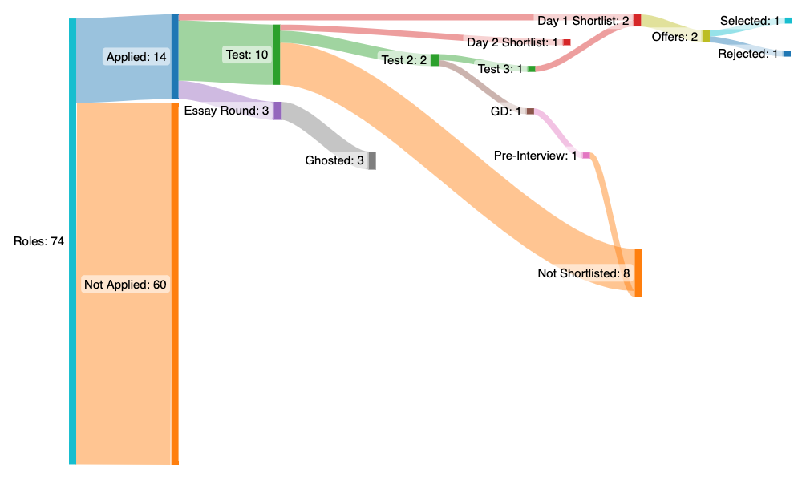

> Not everything goes exactly as planned. That's why it's a plan, not a certainty. 

## Aim was 

To-do; atleast one Internship in the first year, and I'm glad to say that I have been selected as an Algorithmic Trading Intern at [Density](https://density.exchange/) in First semester.(🏌️‍♂️)~~Rejections laughing in the corner.~~ 
Anyways,So, my aim has been accomplished.

>NOW (🦍)

## Aiming in

Before this entire _joomla_ started, I asked myself: _What is it I want from an intern_? 

- I want to tour: I want to go on a some Solo-trip aboroad, but my main goal is my internship, as mentioned earlier(🦍). and I was tired of hearing/seeing how others were roaming the world while I was scooping Ball off the floor of my room.
- I want something that paid well: Apart from the feel-good factor, a good paying intern would put money for my first Car' in the SIPs/Stocks or in anyother assets or I'll just trade with that money who knows but main goal is ... as mentioned earlier.

Above both of these:

- I want something that would **help me in the future**: Research or core CS/Math roles would provide both relevant work experience and also appeal to Trading firms when I go for my fulltime work. I definetly didn't want to pick up finance/consulting/_enterprise/backend/frontend_ development.
- I want something **fun**: Writing high-stakes trading algorithms, making hyper-efficient and superfast systems on embedded devices, implementing object recognition on embedded sensors, receiving patents/publishing papers on new models and algorithms is a small but representative subset of the kind of work I want to do this summer. 

Another way of looking at this is **saying no**: proceed by elimination rather than addition. This requires knowing yourself very well, and seeing if a role really resonates with what you want to do. Eg if you're a product person and have worked in programming clubs, developing systems, then a SDE role would appeal to you. Don't apply to anything other than SDE.

With this in mind, I built up a small shortlist of companies to apply to. Mostly quant and research roles.

## Bluffington, but with higher stakes

Intern season this time formally started off in early July, when talks were held by the Office of Career Services and the resumé portal opened for a short while (albeit there were several deadline extensions). For context, your CV is what companies would shortlist you based on, and for everything you wrote on there, proof was required. I didn't have much to put on it except a large number of projects, some Bug hunter Achievements, And my previous experience at [Density](https://density.exchange/) and some volunteer experience, and I believe that's more than enough for a Tech CV (where shortlisting is mostly done either through CG or through your performance in some arcane test that the company conjures). Just be completely aware of what you're putting in there, and what each project was: the CV is used for HR/Face to face interviews, and you'll probably be quizzed on atleast a couple domains where you've done projects. And please, please, _don't bluff_.

PS: this is only relevant to tech/research roles. I have no idea what makes a good finance/consult CV.

## The Dance of Dragons

 I think the most important thing here is to **Stick to your list**: You'll see friends and most people applying to absolutely everything and anything in the hopes that an intern will materialize somewhere. There are multiple downsides to this:

- Too many tests will tire you out
- Even if you clear all the tests and are shortlisted for interviews from multiple companies, there are only so many Day 1 slots that companies will allocate to you (I think 4 is the upper limit), so even if you want to, you can't sit everywhere.

>NOTE: I will always be grateful to my mentors [Atul Kumar](https://www.linkedin.com/in/overide/) and [Gyan Sharma](https://www.linkedin.com/in/gyan1310/) for their guidance, and this piece of information has also been acquired through their expertise, and since they are working professionals, you can rely on the information they provide.

On the other hand, this does require a lot of tenacity and self-belief, and a _good CG/plenty of skill as well_. There's no one right answer, just make sure you don't switch your strategy out of desperation midway (eg go through your list, then realize that if there are too many companies open and your chances are low, apply to all of them, or vice versa). Go in with a plan, and try to stick to it as much as possible from your end, because you can't control what happens outside.

>NOTE: Everything Matters..every piece of acds/skills.

## Longlists 

After applications, shortlists for tests begin to arrive. Companies have free will in how they'll shortlist people: some are very transparent, and some are opaque to the point of being devious. The test processes for some of the most wanted companies spans multiple tests rather than just one, so keep an eye out on that as well. Also, while companies will do their best to avoid test slot clashes, you will become a walking zombie if you take too many or, in the worst case, will have a bunch of slot clashes. Combined with 8am offline classes and 11pm tests, _just don't push yourself by applying to as many companies as you can_. Just don't.

Another aspect is to not be disappointed if you don't make a test shortlist: it's probably just a random thing (unless there are clear patterns such as a CG cutoff), and you shouldn't beat yourself up about it. Learning to not let these things affect you is hard, but an important learning nevertheless.

## Tests and shortlists

Ah, the tests. Probably my least favourite part, because unless you're super amazing at the test, there's a complete black box behind the outcome (how well your test went) and the interview shortlist

- A test I gave where I thought I'd done pretty well (there was a monte carlo approximation problem that I did nicely), didn't result in a shortlist. Others (who didn't do this problem) got shortlisted.
- A test where I thought I'd done poorly resulted in me getting a shortlist
- A company which had multiple rounds of tests, and finally a pre-interview, completely roasted me in the pre-interview, while several others said that they'd found their pre-interview to be _very chill_. They got shortlisted, while I didn't.

Also, most companies won't have tests that are relevant to the work you'd be doing at the company. It's mostly a bunch of CP questions (gets harder for more valuable companies), and if you're in quant, some math MCQ's. Very few companies invest a lot of time and effort in the kind of questions they ask/the processes they take, and it's a pleasure in some sense to give those tests. Also, if the test is too easy, there is no differentiator between you and someone 

This is probably where the completely stochastic nature of life comes face-to-face with you: The stochasticity of the outcome is inversely proportional to your skill, and the only way to minimize it is to be an order-of-magnitude better than everyone else. Or, just get lucky. 

This has two important implications:

- If you got rejected, it doesn't mean that you're worse than the others who got shortlisted.
- If you got shortlisted, it doesn't mean that you're better than the others who got rejected.

A very skilled (and very humble) friend keeps saying _Tukke pe jee raha hu mai_ (I'm living on a fluke) whenever praised for his skills, and it's a brilliant thing to do: accept the universe is larger than you and be grateful for it's outcomes. That way, you're always humble and happy.

## Preference Filling

> In all things, have no preferences. 
> ~ Miyamoto Musashi

This should be a no-brainer by this point. However, more context: Quant got into a bidding war over Talent, with multiple raises: I don't want to quote exact numbers here, but there was an almost 50% increase in the stipend offered, and they were already offering a lot. In addition, Quant companies with foreign bases leveraged their position to offer foreign roles as well, paid in GBP/SGD, which would be a no-brainer for most1. Unfortunately, when I started, this was not there and some of these companies didn't make my shortlist, but for others, if the goalposts change and if you had them in your shortlist, now would be a good time to realistically reconsider where you want to go.

## Faceoff (be it online or offline)

> I have three Interview experiences with real person at [Trexquant Investment Lp](https://trexquant.com/), [Density](https://density.exchange/) and, Recently, one with AI at [Mercor](https://mercor.com/) till now. 

So you're walking in for interviews, sharply dressed, with your resume/CV in hand. What now? It's easy to say "Just be cool", but very hard to do. I think the most important thing is to go with the flow and be yourself, atleast in tech. And remember to keep it simple: start off with the simplest solution you can think of, then layer in complexity. In an interview, emphasis is on communication and clarity of thought rather than complexity, and if you're starting off simple, it's much easier to hook in your interviewer and keep him in your thought process rather than starting off complex and trying to break down complexity to explain to him (mostly because they anyway have a more complex problem, which they'll spring upon you once you solve the simple problem correctly).

## What now?

So your interviews are over, and you're waiting at your room, playing cards and biding time till your offer comes in. Just do that, Be cool.  
What does your next LinkedIn post say?

_drumrolls_

 
I'm pleased to announce that I'll be joining <b>XYZ</b>  as a <b>Algorithmic Trading Intern</b>. I'll be working on optimizing their low-latency systems and finding out what goes into the tech that makes one of the world's leading market makers tick.
 

`</linkedin post>`

Truth be told, it's not as simple as this. Never is. Here's a small sankey diagram I made of how the entire process unfolded.

I had two shortlists and ended up converting both, and I really enjoyed the interview processes in both the companies I applied to. Very kind and very smart interviewers, very cool people overall. Would've loved to send one half of me to each company, but unfortunately that's not possible :')

>> All the best, and happy intern hunting!

