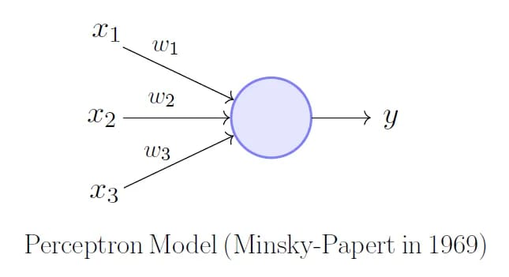
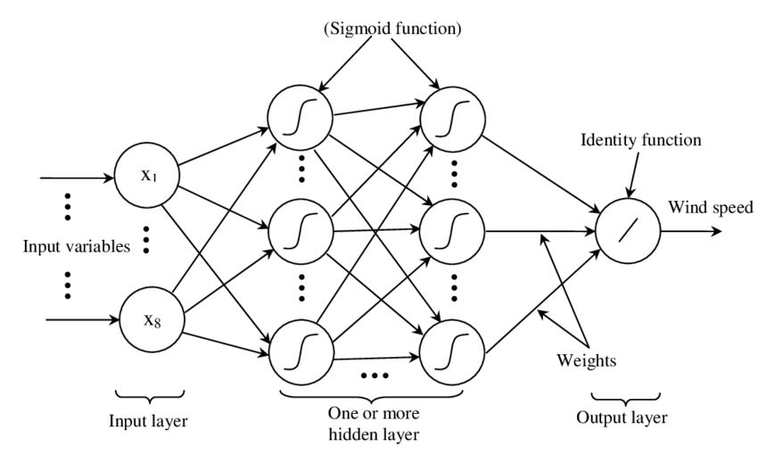

## Introduction

Machine learning is becoming one of the most revolutionary techniques in data science, allowing us to find nonlinear relationships between features and use it to predict new samples. One of the simpler methods in machine learning is the Multilayer Perceptron. In this article, I will discuss the concept behind the multilayer perceptron, and show you how you can build your own multilayer perceptron in Python without the popular `scikit-learn` library. I feel that building the multilayer perceptron from scratch without the libraries allows us to get a deeper understanding of how ideas such as backpropagation and feed forward work. So, I have added both of them in folder `MLP_from_Srcatch`, which contains the notebook [`MLP.ipynb`](https://github.com/Aditya-dom/PerceptronPulse/blob/main/MLP_from_Scratch/MLP.ipynb) where I built the perceptron from scratch without using any library and I **highly** recommend reading (at least) [chapters 1 & 2 of the free online book: Neural Networks and Deep Learning](http://neuralnetworksanddeeplearning.com/) for a more complete discussion and in `MLP.py` & `test.py` where I've used numpy and pandas only.
The whole code can be found in my Github: [PerceptronPulse](https://github.com/Aditya-dom/PerceptronPulse)

>> Question: Why should I read your blog?

>> Answer: You should read my blog because, I think, imagine, you're standing in-front of God, and God asked you about perceptrons. if you can explain it, I will tell forgive all your sins and let you into heaven ( or anything you want). I mean, who knows?, it's better to be prepared! Anyways.  

## Perceptron

Before tackling the multilayer perceptron, we will first take a look at the much simpler single layer perceptron. The perceptron takes in n inputs from the various features x, and given various weights w, produces an output. This output gets put into a function that returns 1 if the input is more than 0 and -1 if it’s less that 0 (essentially a Heavyside function).



The learning occurs when the final binary output is compared with out training set outputs. The difference between the two is multiplied by a learning rate and the input value, and added to the weight as correction. This is the only ‘backpropagation’ that occurs in the perceptron. As we will see later, this idea of backpropagation becomes more sophisticated as we turn to MLP. The perceptron can be implemented into python very easily, especially with numpy’s highly optimised matrix operations. This is the code for perceptron:

```python
import numpy as np
class Perceptron(object):
def __init__(self, learn, itr):
        """
        :param learn: learning rate
        :type learn: float
        :param itr: number of iterations
        :type itr: integer
        """
        self.learn = learn
        self.itr = itr
def train(self, x, y):
        """
        Train the weights with data set x for outputs y
        :param x: training data features
        :type x: array (matrix) of n-samples, n-features
        :param y: training data outputs
        :type y: array of n-samples
        :return: weights (w) and errors for each iteration
        """
        self.w = np.zeros(1 + x.shape[1])
        self.error = []
        for _ in range(self.itr):
            errors = 0
            for xi, target in zip(x, y):
                update = self.learn*(target - self.predict(xi))
                self.w[1:] += update*xi
                self.w[0] += update
                errors += int(update != 0)
            self.error.append(errors)
        return self
def predict(self, x):
        """
        :param x: input vector of features
        :type x: ndarray
        :return: int 1 or -1
        """
        self.output = np.dot(x, self.w[1:]) + self.w[0]
        return np.where(self.output >= 0, 1, -1)
```

Now that we have looked at the perceptron, we can dive into how the MLP works.

## Multilayer Perceptron

As the name suggests, the MLP is essentially a combination of layers of perceptrons weaved together. It uses the outputs of the first layer as inputs of the next layer until finally after a particular number of layers, it reaches the output layer. The layers in between the input and output layers are called hidden layers. As with the perceptron, MLP also has weights to be adjusted to train the system. These weights now come in a matrix form at every junction between layers.



## Feedforward

The first part of creating a MLP is developing the feedforward algorithm. Feedforward is essentially the process used to turn the input into an output. However, it is not as simple as in the perceptron, but now needs to iterated over the various number of layers. Using matrix operations, this is done with relative ease in python:

```python
def feedforward(self, x):
    """
    Predict the output given the inputs
    :param x: input vector of features
    :type x: ndarray
    :return: All activation values and x values.
    """
    self.z0 = np.dot(self.w0, x)
    self.output1 = self.sigmoid(self.z0)
    self.z1 = np.matmul(self.w1, self.output1)
    self.output2 = self.sigmoid(self.z1)
    self.z2 = np.matmul(self.w2, self.output2)
    self.output3 = self.sigmoid(self.z2)
return self.z0, self.output1, self.z1, self.output2, self.z2, self.output3
```

## Backpropagation
It is time to discuss the most important aspect of any MLP, it’s backpropagation. In order to understand backpropagation, we need to have the understanding of basic calculus, which you can learn more about from this excellent introduction to calculus by the YouTuber 3Blue1Brown here.

Backpropagation relies primarily on the chain rule. We want to find out how changing the weights in a particular neuron affects the pre-defined cost function. Since we have a function that brings us from the set of weights to the cost function, we are allowed to differentiate with respect to the weights. The issue is that we do not have the explicit solution to this function from weights to cost function, so we need to make use of the chain rule to differentiate ‘step-by-step’:

                   
$$\frac{\partial C}{\partial w_1} = \frac{\partial C}{\partial y_2} \frac{\partial y_2}{\partial z_2} \frac{\partial z_2}{\partial w_1}\$$

Each of the constituents of the chain rule derivative is known. Hence this greatly simplifies the calculation of gradient of the cost function required for the backpropagation. Now the gradient becomes:

$$\nabla C = \left\langle \frac{\partial C}{\partial w_0}, \ldots, \frac{\partial C}{\partial w_n} \right\rangle\$$

with each of the components known. The change in weights for each training sample is:

$$\Delta w = -\eta \nabla C\$$


where $\eta$ is the learning rate, a hyperparameter that can be used to change the rate at which the weights change. This is usually set to small values until further optimisation of the hyperparameter is done. Now that we are equipped with the knowledge of how backpropagation works, we are able to write it in code.

```python
for _ in range(self.itr):
    for xi, target in zip(self.x, self.y):
        self.feedforward(xi)
        cost = target.T - self.output3

for i in range(self.w2.shape[0]):
            self.w2[i] += -self.learn * cost.sum() * \ 
self.sigmoid(self.z2) * (1 - self.sigmoid(self.z2)) * \ 
self.output2[i]

for i in range(self.w1.shape[0]):
            for j in range(self.w1.shape[1]):
                self.w1[i, j] += -self.learn * cost.sum() *\
self.sigmoid(self.z2) * (1 - self.sigmoid(self.z2)) * self.w2[i] * \
self.sigmoid(self.z1[i]) * (1 - self.sigmoid(self.z1[i])) * \ 
self.output1[j]

for i in range(self.w0.shape[0]):
            for j in range(self.w0.shape[1]):
                self.w0[i, j] += -self.learn * cost.sum() * \ 
self.sigmoid(self.z2) * (1 - self.sigmoid(self.z2)) * self.w2[i] * \
self.sigmoid(self.z1[i]) * (1 - self.sigmoid(self.z1[i])) * \ 
self.w1[i, j] * self.sigmoid(self.z0[i]) * (1 - \ 
self.sigmoid(self.z0[i])) * xi[j]
```
As you can tell, the hardest part about writing backpropagation in code is handling the various indices in `numpy` arrays.

## Conclusion
Writing a multilayer perceptron program is very fun, but the actual functionality is not optimised. Preexisting libraries such as keras use various tools to optimise their models. So if you want to create machine learning and neural network models from scratch, do it as a form of coding practice and as a way to improve your understanding of the model itself.

>> Have Nice Day Man!

