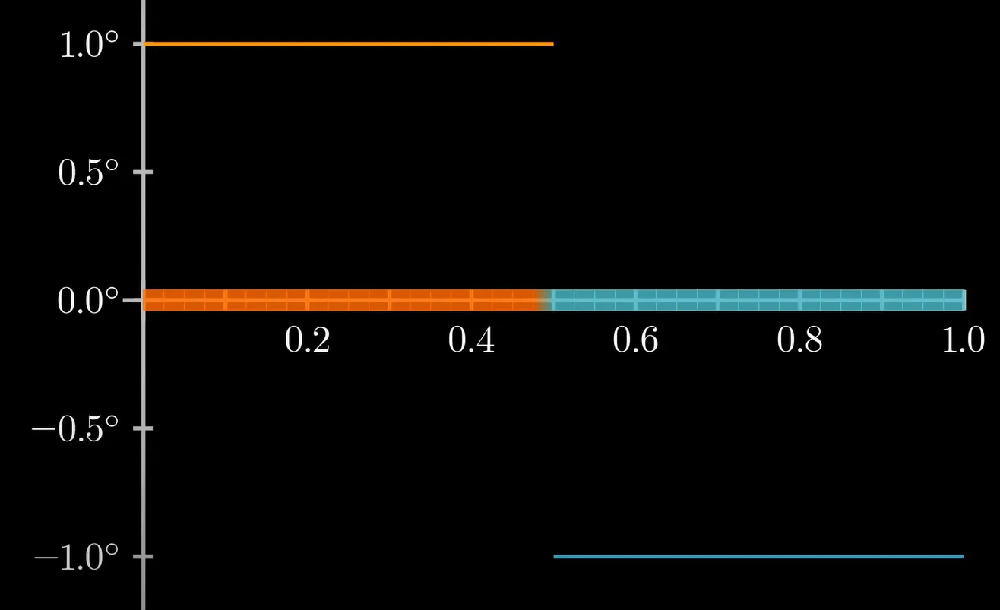
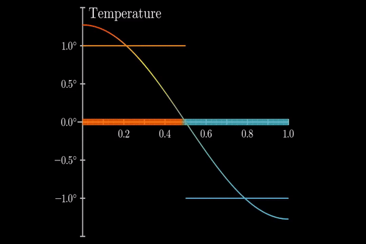
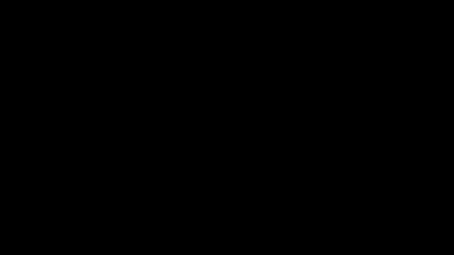
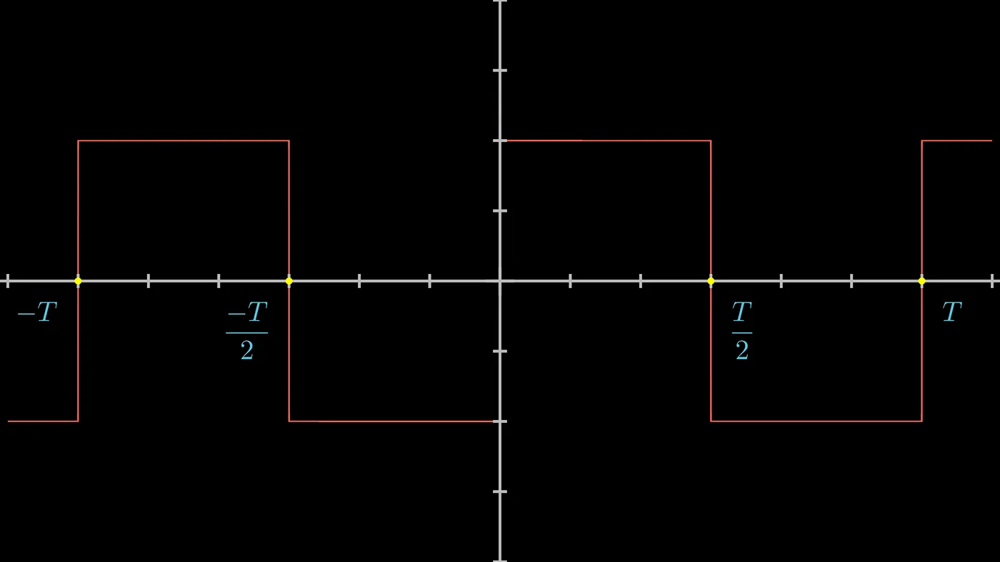
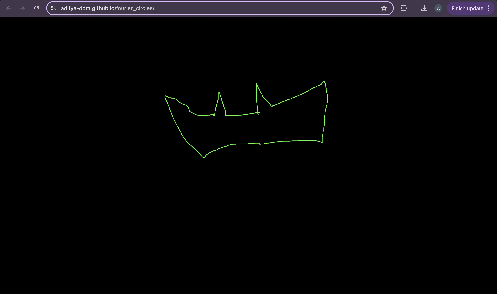
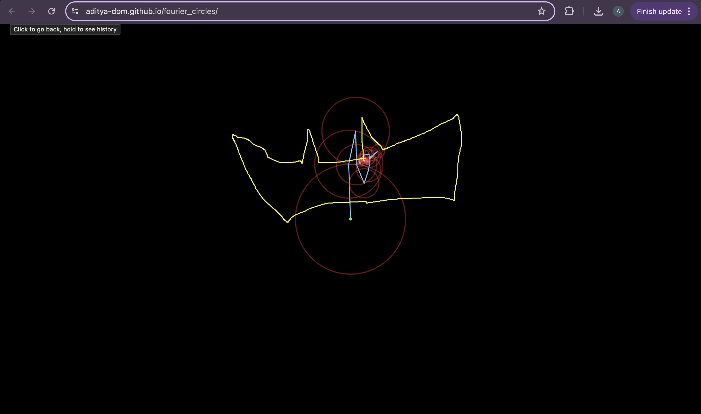

## The Begining

It all starts when Joseph Fourier started to analyze the Heat Equation which looks like:

### $\frac{\partial u}{\partial t} = \alpha \nabla^2 u$  or  $\frac{\partial T(x, y)}{\partial t} = \alpha \frac{\partial^2 T(x, y)}{\partial x^2}$

> Here T represent Temperature at any position x at time t

where:
- \( $u = u(x,t)$ \) is the temperature distribution function,
- \( $t$ \) is time,
- \( $x$ \) represents the spatial coordinates (can be in 1D, 2D, or 3D),
- \( $\alpha$ \) is the thermal diffusivity of the material,
- \( $\nabla^2$ \) is the Laplace operator.

This equation is what we call A Linear Partial Differential Equation , what it means is ,

If we have 2 solutions $(\phi1 and \phi2)$ which are different and satisfies a Boundary condition then we can write:

A new solution=> $$Y = (a × \phi1) + (b × \phi2)$$

where a and b are 2 arbitrary constants which depends upon the Initial Conditions. But how it is so powerful . As we know the solution will give us some combination of sine and cosine function. So what?
 
>> **Ps: I am a Mechnical Engineering Student 😎😤**

To understand what I mean , let’s take a simple example. We will consider an imaginary perfect metal rod, which have 2 different temperatures on two different sides with respect to it’s midpoint. Let’s see what I mean graphically:

> The rod has 2 different temperatures on 2 different side w.r.t it’s midpoint.

So, If we mark temperature on **Y-axis** and position on **X-axis**, then as you can see, we get what we call a **Step Function**.

But wait a minute, I have told you the solution we get from the Heat Equation are **_Linear combination_** of cosine or sine function.

But our assumed system of Rod should also be solvable with the same method and should give us A Linear combination of Sine and Cosine(i.e., **we will get Step function using Periodic sine and cosine function?? w.t.f**)

This is where Fourier make a move, what we call a **_pro-gamer_** move and become immortal in the world of Science.

As you can see in the gif, As we keep adding the cosine or sine or their combination (depends on boundary condition) with appropriate coefficients(in our discussion similar to a and b),we are getting something close to our desired function. But our function is discontinuous and even that can’t stop us!!, Now you understand how powerful it is? You may say, well It looks like our function but it is not exactly that, I will say yes you are right. What we have is just an approximation but as we add more and more solutions of the Differential Equation shown above , We will get more and more close to our function. Here I have given you a playing thing, Try increasing number of terms and see how you approaches to that function(More general square wave).

> Now we understand the idea behind this beautiful method. So, Now let’s see how to calculate one.

***

## Fourier Series of a Function:

If a function f(x) of some real variable x, defined and integrable in the interval
( $c,c+2L$ ), satisfies Dirichlet’s Conditions i.e.,

>1. f(x) is single valued and finite,
>2. f(x) is piecewise continuous having at most finite number of finite discontinuities,
>3. f(x) has at most finite number of maxima and minima within the interval, then f(x) can be expanded in this interval into the following series, called Fourier Series.

__- For a function \( $f(x)$ \) with period \( $2L$ \), the Fourier series representation is given by:__

$$f(x) = a_0 + \sum_{n=1}^{\infty} \left( a_n \cos\left(\frac{n \pi x}{L}\right) + b_n \sin\left(\frac{n \pi x}{L}\right) \right)$$

> where:
- \( $a_0$ \) is the average value of the function over one period,
- \( $a_n$ \) and \( $b_n$ \) are the Fourier coefficients, given by:

$$a_0 = \frac{1}{2L} \int_{-L}^{L} f(x) \, dx$$

$$a_n = \frac{1}{L} \int_{-L}^{L} f(x) \cos\left(\frac{n \pi x}{L}\right) \, dx \quad \text{for} \; n \geq 1$$

$$b_n = \frac{1}{L} \int_{-L}^{L} f(x) \sin\left(\frac{n \pi x}{L}\right) \, dx \quad \text{for} \; n \geq 1$$

__- Consider a function \( $f(t)$ \) with period \( $T$ \) in the interval \( $(c, c+T)$ \). The angular frequency \( $\omega$ \) is defined as:__

$$\omega = \frac{2\pi}{T}$$

> **The Fourier series representation in terms of \( $\omega$ \) can be written as:**

$$f(t) = a_0 + \sum_{n=1}^{\infty} \left( a_n \cos\left(n \omega (t - c)\right) + b_n \sin\left(n \omega (t - c)\right) \right)$$

> where:
- \( $a_0$ \) is the average value of the function over one period,
- \( $a_n$ \) and \( $b_n$ \) are the Fourier coefficients, given by:

$$a_0 = \frac{1}{T} \int_{c}^{c+T} f(t) \, dt$$

$$a_n = \frac{2}{T} \int_{c}^{c+T} f(t) \cos\left(n \omega (t - c)\right) \, dt \quad \text{for} \; n \geq 1$$

$$b_n = \frac{2}{T} \int_{c}^{c+T} f(t) \sin\left(n \omega (t - c)\right) \, dt \quad \text{for} \; n \geq 1$$

> Triangular Wave formation using just pure sine waves

**The GIF where the Square wave(Step Function for a particular case) or Triangular wave is formed as an example of this series. As you can see we are just adding pure waves with certain frequency and amplitude. They are just waves and not have any circles in it.**

In these $2$ equations $a0$, an and bn are called Fourier Constants and are given by

$$a_0 = \frac{1}{T} \int_{c}^{c+T} f(t) \, dt$$

#### \( a_n \) - The Cosine Coefficients

$$a_n = \frac{2}{T} \int_{c}^{c+T} f(t) \cos\left(n \omega (t - c)\right) \, dt \quad \text{for} \; n \geq 1$$

#### \( b_n \) - The Sine Coefficients

$$b_n = \frac{2}{T} \int_{c}^{c+T} f(t) \sin\left(n \omega (t - c)\right) \, dt \quad \text{for} \; n \geq 1$$

The value of ($a0/2$) is found by putting $n = 0$ , so I have not written it.

If you want the proof, just use the [orthogonality of sine and cosine](https://tutorial.math.lamar.edu/Classes/DE/PeriodicOrthogonal.aspx) .

So, We have seen that we can expand any function(which satisfies certain conditions) into a series of sine and cosine. But **where are the circles which you see in the Joker or What is Fourier series gif?** To understand this we have to go back to the equation

$$exp(iθ) = cos(θ)+i sin(θ)$$ ; Where $i$ is the square root of $-1$

This equation tells us that $exp(iθ)$ represent a circle as $cos(θ)$ and $sin(θ)$ also does the same. Using this simple but powerful identity we can write the $f(x)$ in terms of exponential functions and in 2D plane they are represented by circles.

Like you see in this video, We have drawn a **perpendicular from it’s tip to the Imaginary axis**. The curve created because of it is our good old **sine curve**.

Similarly we can get a cosine curve if we draw a perpendicular from the tip to real axis.

So, using the upper identity we can write $f(x)$ as:

$$f(x) = \sum_{n=-\infty}^{\infty} c_n \exp\left(\frac{n \pi i x}{L}\right)$$

> where \( $c_n$ \) are the Fourier coefficients in the complex form.

>> Now you see from where those circles come from.

>Adding each exponent term of the complex Fourier expansion for square wave

In this series each exponent term actually represent a rotating circle with a certain frequency(given by the term inside bracket) and a certain radius(given by cn). Those circles join together(one after another to their radius’s end like shown in the GIF file) to give you the curve or function as you have seen before.

Here cn is equivalent to $\frac{(an-ibn)}{2}$ and \( $c-n$ \) is equivalent to $\frac{(an+ibn)}{2}$. Those constants are given by,

$$c_n = \frac{1}{2L} \int_{c}^{c+2L} f(x) \exp\left(\frac{-n \pi i x}{L}\right) \, dx$$

##

The problems concerning the possibility of expressing a function by Fourier Series are cumbersome. Fortunately almost all functions associated with physical problems are covered by the Dirichlet’s Conditions. Fourier’s Theorem is a set of conditions sufficient to imply the convergence of The Fourier Series to some function closely related to the given function.

Convergence of The Series:
If f(x) and $f`(x)$ are sectionally continuous in $-L$ to $L$ and $f(x)$ satisfies Dirichlet conditions then according to Fourier Theorem we can say:

The Fourier series of f(x) converges to ${(f(x+)+f(x-)}{2}$

If f(x) is discontinuous at a point x0, then the Fourier series of f(x) converges to ${f(x0+ɛ)+f(x0-ɛ)}{2}$ as $ɛ→0$.

Odd-Even Function Trick:
When we expand any function we have an equation with a Left hand side and Right hand side . As both sides must be equal, If one side has even function , then another one must be even and if one is odd then other must be odd also. This simple idea is very far reaching and it reduces the complexity of calculation.

As we know cosine is an even function so if $f(x) = f(-x)$, then Expansion of $f(x)$ only contains terms with cosines and if $f(x) = -f(-x)$, then Expansion of $f(x)$ only contains terms with Sine as sine is a odd function.
***

### Calculation:
Let’s calculate the fourier series of the square wave as an example:

$$
f(t) = \begin{cases} 
1 & \text{for } -\frac{T}{2} \leq t < 0 \\
1 & \text{for } 0 \leq t < \frac{T}{2} 
\end{cases}
$$

As you can see the Square wave is defined as shown here.

As you can notice $f(t) = -f(-t)$, this means we must have odd terms only when we expand this function. This means we will only have the **sine terms i.e., the terms whose coefficient are bn.** This insight reduced our half work and we will now only consider sine terms and not cosines.

To solve this problem as i have told before , we just need _bn_ due to the symmetry as shown in the figure. To understand it’s intuition see the p5.js sketch hyperlinked with the text *“Playing Thing”* before the discussion _Fourier Series of a Function._

>This is the Square wave where T = 3

we know \( $b_n = \frac{2}{T} \int_{\frac{-T}{2}}^{\frac{T}{2}} f(t) \sin \left( \frac{2\pi nt}{T} \right) dt$ \), 
here \( $c = -\frac{T}{2}$ \) and \( $2L = T$ \). 
This gives us \( $c + 2L = L - \frac{T}{2} + T = \frac{T}{2}$ \). 

> Then:

$$b_n = \frac{2}{T} \left[ \int_{0}^{\frac{-T}{2}} f(t) \sin \left( \frac{2\pi nt}{T} \right) dt + \int_{0}^{\frac{T}{2}} f(t) \sin \left( \frac{2\pi nt}{T} \right) dt \right]$$

> Now we substitute \( $t = -x$ \) in the first one.

$$b_n = \frac{2}{T} \left[ \int_{0}^{\frac{-T}{2}} f(-x) \sin \left( \frac{2\pi n(-x)}{T} \right) (-dx) + \int_{0}^{\frac{T}{2}} f(t) \sin \left( \frac{2\pi nt}{T} \right) dt \right]$$

> As for this function \( $f(t) = -f(-t)$ \), we get

$$b_n = \frac{2}{T} \left[ \int_{0}^{\frac{T}{2}} f(x) \sin \left( \frac{2\pi nx}{T} \right) dx + \int_{0}^{\frac{T}{2}} f(t) \sin \left( \frac{2\pi nt}{T} \right) dt \right]$$

>As \( $x$ \) and \( $t$ \) are both dummy variables we replace them both by \( $r$ \) and get ,

$$b_n = \frac{4}{T} \int_{0}^{\frac{T}{2}} f(x) \sin \left( \frac{2\pi nr}{T} \right) dr = \frac{2}{\pi n} [1 - (-1)^n]$$

:::note
When \( $n$ \) = even, \( $b_n = 0$ \) and when \( $n$ \) = odd, \( $b_n = \frac{4}{\pi n}$ \). Thus we have,
:::

$$f(t) = \frac{4}{\pi} \left[ \sin(\omega t) + \frac{\sin(3\omega t)}{3} + \frac{\sin(5\omega t)}{5} + \dots \right]$$

, where \( $\omega = \frac{2\pi}{T}$ \)

>**This is the solution.**

As you can see here I have used the series of **sine and cosine expansion**(with $an=0$), but you can also expand the Square wave using **exponent terms , which is signified by the fact that you can create that using Rotating Phasors(vectors) as shown before.**

***

### End:
The Fourier Series is a way of representing certain functions(mostly all periodic functions). From classical physics to Quantum Mechanics, even in data processing, It is used . It is one of the most powerful tool ever created by Maths.

We have discussed so much but even now **there are many topics left**. This post is already long so we will discuss the remaining things later. I hope this article will help you in building intuition and will help you in solving many basic problems. With this let’s end our discussion here.

If you want to make any drawing using epicycles, [here](https://github.com/Aditya-dom/fourier_circles) is my github repo and deployed [link](https://aditya-dom.github.io/fourier_circles/). Just download that repository and use it for creating beautiful animations. But remember the best result will come when the used images will be single-line drawing.

> I have written this [Sketch](https://aditya-dom.github.io/fourier_circles/) try it out to draw circular Fourier Series.
(As an example see the screenshot)

>> I'm Batman 🦇

>Upper one is the Drawing and Lower one is the Series Breakdown to circle

#### Copyright stuff:
All the images and gif used here are all created using a python library called Manim , developed by Grant Sanderson and p5.js developed by Lauren McCarthy . All equations and calculations used are written by me using Latex/Katex.

