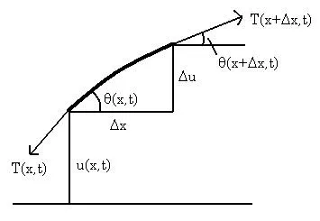

### Le Phir Aagaye 😤

Anyone familiar with Partial Differential Equations (PDEs) will know how cumbersome they can be to solve. In this post we will look at applying what we have learnt in our [Fourier Analysis](https://arawn.live/posts/fourier-intro/). First off, we use Fourier Series to solve the wave equation on a membrane and subsequently we will investigate a generalised approach to solving PDEs using the Fourier Transform.

## Wave Equation
I have a policy that you should not use formulas you do not understand and cannot derive using basic principles. Hence, I shall begin by deriving the wave equation using simple Newton’s Laws of motion. This analysis is actually for my better understanding of advance mathematics for Quant.

Deriving the wave equation is not as complicated as it seems. Consider the following section of a string:

We know from Newton’s Second Law that

$$
\mathbf{F} = m\mathbf{a}
$$

For the string section above, this can be rewritten as

$$
F = \rho \Delta x \frac{\partial^2 u}{\partial t^2}
$$

Now we need to calculate the forces acting on the string section

$$
T(x, t) \cos(\theta(x, t)) = T(x + \Delta x, t) \cos(\theta(x + \Delta x, t)) = \phi
$$

This is true because the string does not move in the horizontal direction. Since the resultant force is upward,

$$
F = T(x + \Delta x, t) \sin(\theta(x + \Delta x, t)) - T(x, t) \sin(\theta(x, t))
$$

With some trigonometry, this becomes

$$
F = \phi \left(\tan(\theta(x + \Delta x, t)) - \tan(\theta(x, t))\right)
$$

Since tangent of the angle is just the gradient at that point, we get

$$
F = \phi \left(\frac{\partial u}{\partial x}(x + \Delta x, t) - \frac{\partial u}{\partial x}(x, t)\right)
$$

Combining the equations,

$$
F = \phi \left( \frac{\partial u}{\partial x}(x + \Delta x, t) - \frac{\partial u}{\partial x}(x, t) \right)
$$

$$
\frac{\frac{\partial u}{\partial x}(x + \Delta x, t) - \frac{\partial u}{\partial x}(x, t)}{\Delta x} = \frac{\rho}{\phi} \frac{\partial^2 u}{\partial t^2}
$$

Taking the limit as \( $$\Delta x$$ \) goes to zero, we get the famous wave equation:

$$
\frac{\partial^2 u}{\partial x^2} = \frac{\rho}{\phi} \frac{\partial^2 u}{\partial t^2}
$$

This can also be generalised to higher dimensions,

$$
\nabla^2 u = \frac{1}{c^2} \frac{\partial^2 u}{\partial t^2}
$$

One important note is that the c in the equation above is the wave velocity, and we can see that it only depends on the density of the rope and tension at which it is pulled.

## Solving the Wave Equation on a membrane
Now we can move on to solve the wave equation on a membrane. In two dimensional polar coordinates, the laplacian in the wave equation can be written as

$$
\frac{\partial^2 u}{\partial r^2} + \frac{1}{r} \frac{\partial u}{\partial r} + \frac{1}{r^2} \frac{\partial^2 u}{\partial \theta^2} = \frac{1}{c^2} \frac{\partial^2 u}{\partial t^2}
$$

Now we use an elementary method for solving PDEs called separation of variables. Let

$$
u(r, \theta, t) = z(r) v(\theta) w(t)
$$

Rewriting the wave equation using the new functions, and dividing by the product of the functions, we obtain

$$
\frac{z''(r)}{z(r)} + \frac{1}{r} \frac{z'(r)}{z(r)} + \frac{1}{r^2} \frac{v''(\theta)}{v(\theta)} = \frac{1}{c^2} \frac{w''(t)}{w(t)} = -\lambda^2
$$

Since the expressions are functions of different variables, yet equal, we can conclude that they must equal a constant. We have assigned this constant to be lambda. The square and negative sign is to make the final result easier to write.

We start solving the time equation:

$$
w''(t) + c^2\lambda^2 w(t) = 0
$$

From basic ODEs, we know the solution to this is

$$
w(t) = C_1 \cos(\lambda c t) + C_2 \sin(\lambda c t)
$$

Where C1 and C2 are constants determined by the initial conditions. Those of you with a keen eye might see that this solution looks awfully similar to the Fourier Series, and yes, we will be using it to solve for the constants.

Now, given the above solution, we rewrite the wave equation as

$$
r^2 \frac{z''(r)}{z(r)} + r \frac{z'(r)}{z(r)} + \lambda^2 r^2 = -\frac{v''(\theta)}{v(\theta)} = n^2
$$

where I have introduced n² as a new constant. Now we are in position to solve the angular component of the wave equation

$$
v''(\theta) + n^2 v(\theta) = 0
$$

Again this is a trivial ODE with solution

$$
v(\theta) = D_1 \cos(n\theta) + D_2 \sin(n\theta)
$$

Finally, using all the above information, we construct the following form of the wave equation

$$
r^2 z''(r) + r z'(r) + (\lambda^2 r^2 - n^2) z(r) = 0
$$

Now we use the following transformation

$$
R^2 z''(R) + R z'(R) + (R^2 - n^2) z(R) = 0
$$

This is the famous Bessel differential equation. Although there is no analytic solution to this differential equation, we construct a solution called the Bessel function, $J(R)$ and $Y(R)$ of order n, that solves this differential equation. The Bessel function is a well studied function and with very interesting properties. For now, we only focus on solving this differential equation. We get the solution as

$$
z(r) = A_1 J_n(\lambda r) + A_2 Y_n(\lambda r)
$$

Therefore, the overall solution to the wave equation for a vibrating membrane is

$$
u(r, \theta, t) = [A_1 J_n(\lambda r) + A_2 Y_n(\lambda r)][D_1 \cos(n\theta) + D_2 \sin(n\theta)][C_1 \cos(\lambda c t) + C_2 \sin(\lambda c t)]
$$

Now, you may ask, where in all of this does Fourier Series come in. Fourier Series is used to solve for the constants A, D and C, given the initial condition of the membrane. As you may recall from the Fourier Analysis I post, we constructed a way to find the coefficients of the sine and cosine terms by making use of their orthogonal property. However, what are we going to do for the Bessel function? Turns out that the Bessel function is also orthogonal. I shall let you try and prove that as an exercise (not that difficult, just some integration).

Instead of just solving for the coefficients, why not think about it geometrically. We know that Fourier coefficients will solve the problem for us, but why? What the Fourier Series does is it breaks down the initial value function into sines and cosines (or Bessel functions J and Y) and then uses their orthogonality to solve for the coefficients. In other words, looks at how each of the sine and cosine affects the membrane and hence calculate the weights (coefficients) of each of those terms.

## Conclusion
This concludes the first part of our investigation into how we can use Fourier Analysis to solve PDEs. In the next post, I will talk about how we can use the Fourier Transform to find a more generalised method of solving PDEs which turns out to be very useful.

***