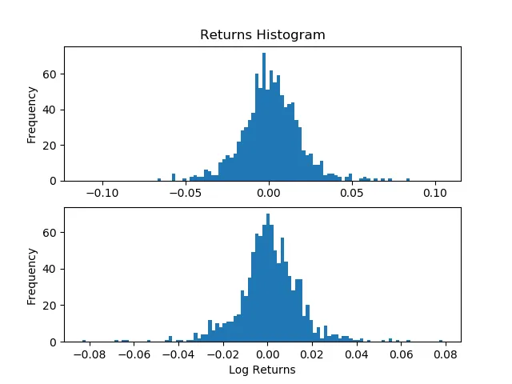
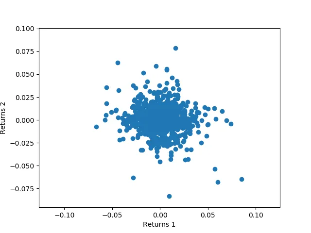

***This is the first of many articles that explains the workings of portfolio optimization. For those interested in investing and trading, I highly recommend you check out the GitHub repository [Quant_OptimalPortfolio](https://github.com/Aditya-dom/Quant_OptimalPortfolio).***

The first step in optimizing portfolios is determining the market invariants for the securities that one is trading. This article investigates the existence of market invariants and looks into how they can be extracted from historical market price data.

## Defintion
Market invariants are defined loosely as data derived from market prices that do not vary over time, or have some determinable statistical nature over time. This can be formalized as

- Market invariants are random variables that are are independently and identically distributed (iid).
To mathematically quantify this, consider these two series

\[ $$x_{t_1} = x_i, \, \text{s.t} \, i = 0, 1, \ldots, \frac{T}{2}$$ \]

\[ $$x_{t_2} = x_i, \, \text{s.t} \, i = \frac{T}{2}, \frac{T}{2} + 1, \ldots, T$$ \]


This series is considered to be an market invariant if

1. $x1$ and $x2$ have ‘similar’ histograms
2. The scatter plot of the series with respect to its time-lagged series resembles a circular cloud (i.e. no correlation)

This is essentially how a market invariant is defined. We will now look at examples of market invariants are discuss the viability of their invariance.

## Stock Returns
The most popular security is stocks. The market invariants for stocks is normally taken to be the compound returns of the stock:

\[ $$x_t = \ln(P_t) - \ln(P_{t-1}), \, \text{for} \, i = 1, 2, \ldots, T$$ \]


Let us test this hypothesis out for some real stock data.
```python
import pandas as pd
import numpy as np
import matplotlib.pyplot as plt
stock_data = pd.read_csv("stock_data.csv", index_col=0)
data1 = stock_data.iloc[1:len(stock_data)//2, 4]
data2 = stock_data.iloc[(len(stock_data)//2)+1:, 4]
ret1 = np.log(data1) - np.log(data1.shift(1))
ret2 = np.log(data2) - np.log(data2.shift(1))
plt.figure(1)
plt.subplot(2, 1, 1)
plt.hist(ret1, bins=100)
plt.title("Returns Histogram")
plt.ylabel("Frequency")
plt.subplot(2, 1, 2)
plt.hist(ret2, bins=100)
plt.xlabel("Log Returns")
plt.ylabel("Frequency")
plt.show()
```

### This gives us the following histogram:



>As we can see, both sets of returns look very similar. Now we can look at how the scatter graph of them will look like.

```python
stock_data = pd.read_csv("stock_data.csv", index_col=0)
data1 = stock_data.iloc[1:len(stock_data)//2, 4]
data2 = stock_data.iloc[(len(stock_data)//2)+1:, 4]
ret1 = np.log(data1) - np.log(data1.shift(1))
ret2 = np.log(data2) - np.log(data2.shift(1))
plt.scatter(ret1, ret2)
plt.xlabel("Returns 1")
plt.ylabel("Returns 2")
plt.show()
```

### This gives us:



## Why This Matters
You may be asking, what is the point of having data that is independent? Would that not make it harder to predict what the data is going to do?

The key principle here is that the data is that although independent, it is **identically distributed**. This means that we can somehow estimate the statistical properties of the distribution that the data comes from. Once we have some gauge of how the data is generated, we can make educated guesses about how to predict what the data will do in the future.

### Roadmap
This is the first of many articles that go through the design and concepts behind Quant_OptimalPortfolio:

1. Detecting Market Invariants
2. Estimating the Distribution of Market Invariants
3. Optimising Allocations in Portfolio using the Estimates
***